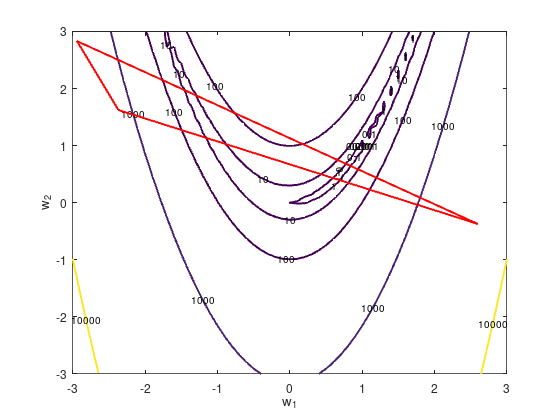

# Downhill Simplex for a Simple ANN
Assignment 3 for ELEC 5404. An implementation of the Nelder–Mead method, and using it to train a very simple neural network.

The Nelder–Mead method is a numerical method for optimization, which works by moving a simplex through the variable space towards the minimum of an objective function:

You can use it to train a neural network by minimizing the error function. As a simple demonstration, we'll model a simple non-linear 1 variable function. 

Initially I wanted to model the current through some FET as a function of $V_{GS}$, $V_{DS}$ but was unable to get a sufficiently low error, so I'll leave that as an exercise for later.

