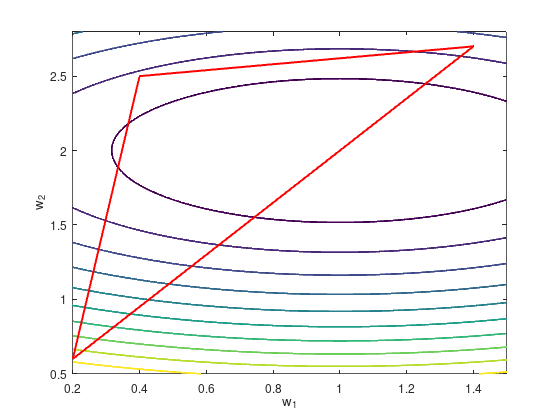

# Downhill Simplex for a Simple ANN
Assignment 3 for ELEC 5404. An implementation of the Nelder–Mead method, and using it to train a very simple neural net.

The Nelder–Mead method is a numerical method for optimization, which works by moving a simplex through the variable space towards the minimum of an objective function:

You can use it train a neural network by minimizing the error function. As a simple demonstration, we can model the $V_{GS}$, $V_{DS}$ surface of a FET, i.e. the current through some FET as a function of gate-source and drain-source voltages.
